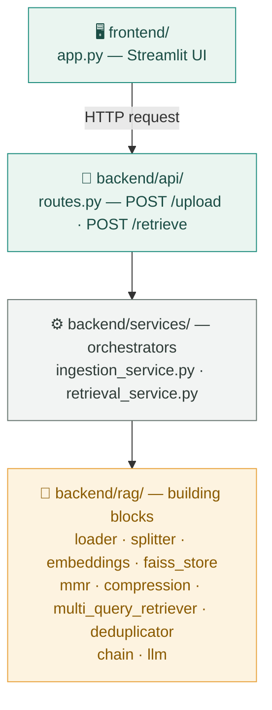
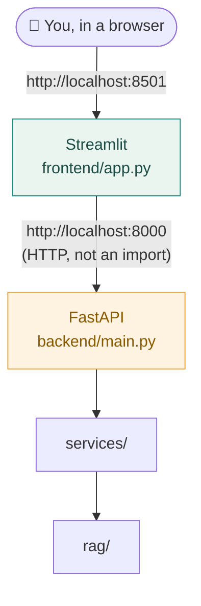
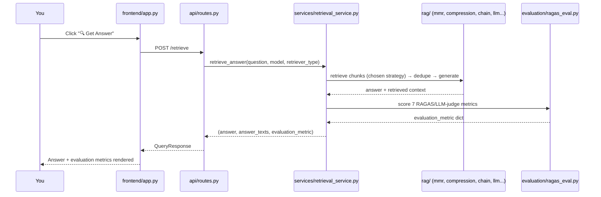

# Student Files for Week 7 Live Session

A complete, runnable mirror of `../src/` — reorganized so you can see the
**whole project flow**, not just the RAG building blocks in isolation. Every
file has a "Student Guide" header explaining what to focus on, plus inline
`# Hint:` comments at the real decision points and a `TODO for students`
section with questions to work through.

## How this is different from just reading `../src/`

Every file here is the **real, working code** — not a stripped
fill-in-the-blank exercise. Read the header comment first, then the hints,
then try the TODOs. Some TODOs reference bugs that were **actually hit**
while building this project (not hypothetical) — those are called out
explicitly, e.g. the frontend crash from a backend call returning `None`,
or the missing-`OPENAI_MODEL` 400 error.

## The project flow, in three architectures

### 1. Application architecture — code layers

Each layer only ever calls the layer directly below it. That's what makes a
bug findable: is the *building block* wrong, or the *orchestration*?



### 2. Runtime architecture — two processes, two ports



> The frontend never imports `rag/` or `services/` directly — it makes a
> real HTTP call, the same way an external client would. See
> `src/frontend/utils.py`'s student notes for why that boundary is
> deliberate, and why `localhost` is correct there (not a bug).

### 3. The request flow — what happens when you click "Ask"



## Folder layout

```
student_files/
├── data/Input_files/     two sample PDFs to test with
├── .env.example          copy to .env and fill in your keys
├── Dockerfile, entrypoint.sh, .dockerignore, requirements.txt
├── deploy/azure/         deploy.sh · teardown.sh · README.md · bicep
├── .github/workflows/    CI/CD (build → push → redeploy on git push)
└── src/
    ├── shared/schemas.py
    ├── frontend/{app.py, utils.py}
    └── backend/
        ├── main.py, core/config.py
        ├── api/{routes.py, health.py}
        ├── rag/            (10 files — the strategies + building blocks)
        ├── services/       (ingestion_service.py, retrieval_service.py)
        ├── evaluation/ragas_eval.py
        └── logger/
```

This mirrors `../src/` exactly — once you understand a file here, you
already understand its production counterpart.

## Suggested reading order

Matches the order the pipeline actually runs, bottom-up:

1. **Foundations** — `src/backend/core/config.py`, `src/backend/rag/embeddings.py`, `src/backend/rag/llm.py`
2. **Data prep** — `src/backend/rag/loader.py`, `src/backend/rag/splitter.py`
3. **Storage** — `src/backend/rag/faiss_store.py`
4. **Retrieval strategies** — `src/backend/rag/mmr.py`, `compression.py`, `multi_query_retriever.py`, `deduplicator.py`
5. **Generation** — `src/backend/rag/chain.py`
6. **Evaluation** — `src/backend/evaluation/ragas_eval.py`
7. **Orchestration** — `src/backend/services/ingestion_service.py`, `retrieval_service.py`
8. **Entry points** — `src/backend/api/routes.py`, `health.py`, `main.py`, `src/frontend/app.py`, `utils.py`

Steps 1-7 are "how the theory becomes maintainable software." Step 8 is
"how it becomes a running app."

## Running it

Uses the same Python environment as `../` (the main `Live/` project) —
just run the commands **from inside this `student_files/` folder**, not
from `Live/`, so `src` resolves to *this* copy instead of the production one.

```bash
# From student_files/, using the same venv already set up for Live/:

# 1. Set up your secrets (separate from Live/src/backend/.env — this one
#    lives here because config.py reads ".env" relative to your cwd)
copy .env.example .env        # Windows
cp .env.example .env          # Mac/Linux
# then edit .env with your real API keys

# 2. Run the backend (terminal 1)
uvicorn src.backend.main:app --host 0.0.0.0 --port 8000

# 3. Run the frontend (terminal 2)
python -m streamlit run src/frontend/app.py
```

Open the URL Streamlit prints (usually `http://localhost:8501`), upload a
sample PDF from `data/Input_files/`, click **Ingest Document**, then ask a
question.

There are two sample PDFs on purpose — upload one, ask a question, then
upload the second one too. This is the actual regression test for
`ingestion_service.py`'s TODO #4: watch the chunk count returned for the
2nd upload — it should be just that file's chunks, not both files' chunks
added together. If a future change reintroduces the whole-directory reload
bug, this is how you'd notice.

## Containerizing and deploying this copy

`student_files/` is a fully self-contained copy for this too — its own
`Dockerfile`, `entrypoint.sh`, `.dockerignore`, and `deploy/azure/` (build
+ push + deploy scripts, teardown, CI/CD workflow), separate from `../`'s.
Build and run it exactly like the main project, just from this folder:

```bash
# from student_files/
docker build -t multidoc-assist-student .
docker run -p 8080:8080 -e OPENAI_API_KEY=$OPENAI_API_KEY -e COHERE_API_KEY=$COHERE_API_KEY -e OPENAI_MODEL=gpt-4o-mini multidoc-assist-student
```

Then `deploy/azure/deploy.sh` walks through the same resource group → ACR →
App Service → app settings flow as the main project's — see
`deploy/azure/README.md` here for the full walkthrough, including the
troubleshooting table for the real issues hit while building this (the
`TasksOperationsNotAllowed` ACR block on free/student subscriptions, the
`WEBSITES_PORT` vs. FastAPI's internal 8000 collision, the missing
`OPENAI_MODEL` 400 error, and the Azure CLI bug that needs a Portal
workaround). Both the Docker build and a full container boot (FastAPI
health-gate → Streamlit) were verified working from this exact folder
before this was handed to you.

Run `deploy/azure/teardown.sh` when you're done so nothing keeps billing.
