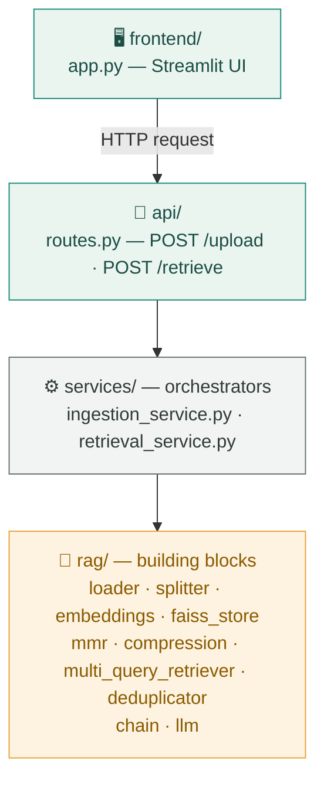
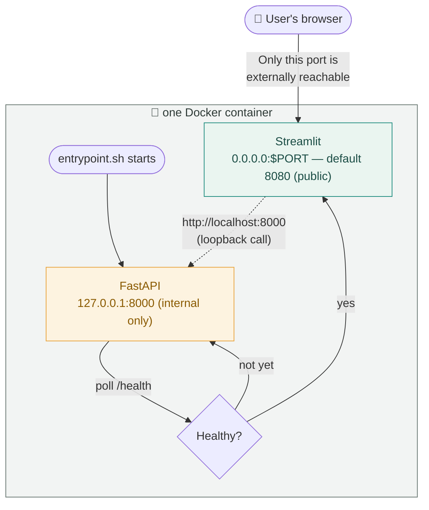
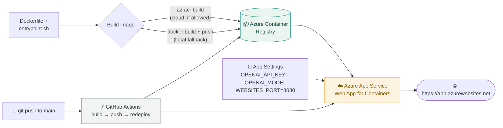

# Multi-Document-Assist
The system shall enable users to upload documents and retrieve precise, context-aware answers in response to their queries based on the content of the uploaded documents.


## Architecture

There are three separate architectures stacked on top of each other here: how
the **code** is organized, how it **runs** inside one container, and how that
container gets **deployed** to a public URL. Each is worth understanding on
its own — a bug in one rarely means the other two are wrong.

<details>
<summary>Original hand-drawn diagram</summary>


</details>

### 1. Application architecture — code layers

Each layer only ever calls the layer directly below it. `app.py` never
touches `rag/` directly — it goes through the API. `routes.py` carries no RAG
logic of its own — it just calls a service. This is what makes a bug
findable: is the *building block* wrong (e.g. `mmr.py`'s λ value), or is the
*orchestration* wrong (e.g. steps called in the wrong order)?



> "RAG is the idea. This folder structure is the implementation."

### 2. Runtime architecture — one container, two processes

FastAPI and Streamlit run **inside the same container**. FastAPI binds to
`127.0.0.1:8000` — internal only, no external route exists to it at all.
Streamlit binds to `0.0.0.0:$PORT` (default `8080`) and is the *only* public
surface. `entrypoint.sh` enforces the startup order: Streamlit does not start
until FastAPI proves it's actually healthy, not just "started."



This is also why `/docs` 404s on the live URL — FastAPI's Swagger page is
real, it just has no route from outside the container. Not a bug; the point.

### 3. Deployment architecture — code to a public URL

The image itself never changes between environments — local Docker, Render,
and Azure all run the exact same image. Only the *configuration around it*
differs (which port to route to, where secrets come from) — which is why
`entrypoint.sh` reads `$PORT` instead of hardcoding a number.



Full deployment walkthrough (including what to do when `az acr build` is
blocked): [`deploy/azure/README.md`](deploy/azure/README.md).

---


## 🖥 Local Installation

1 . Create Environment

```
py -3.12 -m venv .venv
source .venv/bin/activate     # Mac/Linux
.venv\Scripts\activate        # Windows
```

2. Install dependencies
```
pip install -r requirements.txt
```

## ▶ Running Locally (Without Docker)

3. Run FASTAPI 

```
uvicorn src.backend.main:app --host 0.0.0.0  --port 8000
```

4. Run Streamlit

```
python -m streamlit run src/frontend/app.py
```

## ▶ Running with Docker

FastAPI and Streamlit both run inside one container. FastAPI is internal-only
(`127.0.0.1:8000`, not reachable from outside); Streamlit is the public UI and
listens on `$PORT`, defaulting to `8080` — map that one port when running:

1. Build Image

```
docker build -t multi-document-assist .
```

2. Run Container

```
docker run -p 8080:8080 -e OPENAI_API_KEY=$OPENAI_API_KEY -e COHERE_API_KEY=$COHERE_API_KEY -e OPENAI_MODEL=gpt-4o-mini multi-document-assist
```

App 👉 http://localhost:8080 (FastAPI's `/docs` is intentionally not exposed outside the container — it's internal-only by design)

---


## 🖥 Render Deployment Link

```
https://multi-document-assist.onrender.com
```

---

## ☁ Azure Deployment (Week 8)

Deployed to **Azure App Service — Web App for Containers**, built from
`Dockerfile` via `az acr build` when your subscription allows cloud-side ACR
builds (Azure for Students and other free/trial subscriptions block this —
build+push locally with Docker instead; see the troubleshooting table in
`deploy/azure/README.md`). Full walkthrough, the `deploy.sh` / `teardown.sh`
scripts, and the GitHub Actions CI/CD workflow live in
[`deploy/azure/README.md`](deploy/azure/README.md).

```bash
cd deploy/azure
export OPENAI_API_KEY="sk-..." COHERE_API_KEY="..." OPENAI_MODEL="gpt-4o-mini"
./deploy.sh
```