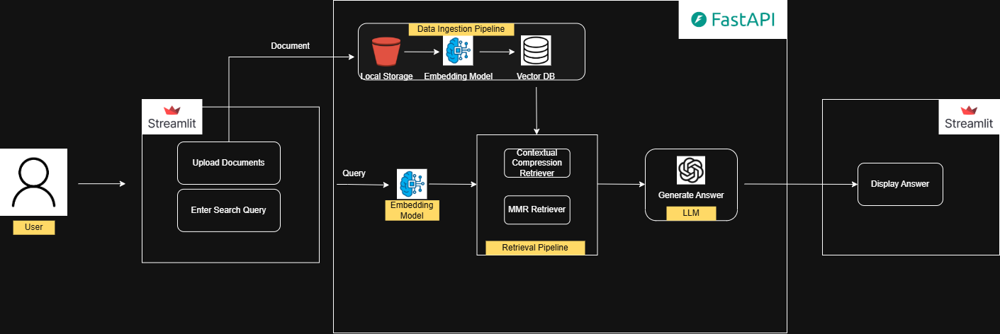

# Week 8 — Project 1 (Part 2): RAGAS + Pydantic + Retry

This week continues the **Multi-Document-Assist** RAG app from Week 7. The app lets a user upload
documents and ask questions about them, answered using retrieval-augmented generation (RAG).

On top of the Week 7 RAG pipeline, Week 8 adds:

- **RAGAS** — automatically scores how good an LLM's answer actually is (faithfulness, relevancy, recall, hallucination, etc.)
- **Retry (`tenacity`)** — makes LLM/API calls resilient to transient failures
- **Pydantic** — validates data going in and out of the FastAPI backend
- A side-by-side comparison of **vector databases** (FAISS, Chroma, Pinecone, Qdrant)



---

## Start here

If this is your first time in this folder, **don't open the backend source code yet** — open the
notebooks first, in this exact order. Each one is self-contained and builds on the previous one:

1. **`src/backend/1. student_demo_inclass.ipynb`**
   FastAPI basics — what CORS is, what middleware does, why this project uses FastAPI for the
   backend and Streamlit for the frontend (instead of one Streamlit/Chainlit app doing everything).

2. **`src/backend/2. student_ragas_retry_pydantic_concepts.ipynb`**
   The main theory notebook for this week. Three parts: what RAGAS metrics actually measure, how
   the `@retry` decorator retries failed calls, and how Pydantic validates data. There's a slide
   deck that goes with it: `src/backend/RAGAS_retry_Pydantic_Concepts.pptx`.

3. **`src/VectorDBs/3. chroma.ipynb`**
   Hands-on: load a document → split it → embed it → store it → retrieve from it, using **Chroma**
   (a vector database that saves to a local folder).

4. **`src/VectorDBs/4. pinecone.ipynb`**
   Same steps as above, but using **Pinecone** (a managed vector database in the cloud).

5. **`src/VectorDBs/5. qdrant.ipynb`**
   Same steps again, using **Qdrant** (cloud or self-hosted, supports hybrid search).

6. **`src/VectorDBs/6. VectorDB_Specialisation_Comparison.ipynb`**
   Runs FAISS, Chroma, Pinecone, and Qdrant side by side and times/compares them. Read this **last**
   — it only makes sense after you've seen each database individually in notebooks 3-5.

Once you've gone through all 6 notebooks, you understand every concept used in the actual app
(`src/backend/` + `src/frontend/`). That app is described file-by-file below.

---

## 📁 What's in each folder and file

```
.
├── README.md                 ← you are here
├── requirements.txt           ← Python packages this project needs (pip install -r requirements.txt)
├── Dockerfile                 ← builds a container that runs both backend + frontend together
├── .env.example                ← template for your secret keys — copy to .env and fill in (see below)
│
├── data/
│   ├── Input_files/             ← sample PDF/TXT documents you can upload to test the app
│   ├── supporting_documents/    ← architecture diagram + a Word doc describing the design
│   └── faiss_index_*/           ← ready-made FAISS indices (one per embedding model). These let you
│                                   ask questions immediately without uploading/ingesting anything first.
│
├── logs/                       ← auto-created log files from running the backend (safe to delete; regenerates)
│
└── src/
    ├── backend/                  ← the FastAPI app (the "engine" of the project)
    │   ├── main.py                  Creates the FastAPI app, adds CORS + request-logging middleware,
    │   │                            wires up LangSmith tracing, registers the routes below
    │   ├── .env.example              Same template as the root one — this app needs its own copy here
    │   │                              (see "Why are there 3 .env files?" below)
    │   ├── 1. student_demo_inclass.ipynb              ← notebook 1 (see "Start here")
    │   ├── 2. student_ragas_retry_pydantic_concepts.ipynb  ← notebook 2
    │   ├── RAGAS_retry_Pydantic_Concepts.pptx          ← slides that accompany notebook 2
    │   │
    │   ├── api/
    │   │   ├── routes.py             Defines POST /upload (ingest a file) and POST /retrieve (ask a question)
    │   │   └── health.py             Defines GET /health — used by Docker to know the backend is ready
    │   │
    │   ├── core/
    │   │   └── config.py             Reads your .env file into a typed `settings` object (a Pydantic
    │   │                              `BaseSettings` class) — every API key in the app comes through here
    │   │
    │   ├── rag/                      The actual RAG building blocks, one job per file:
    │   │   ├── loader.py               Reads a PDF/DOCX/TXT file into LangChain `Document` objects
    │   │   ├── splitter.py             Splits long documents into smaller overlapping chunks
    │   │   ├── embeddings.py           Turns text into vectors — supports OpenAI (large/small) and Cohere
    │   │   ├── faiss_store.py          Saves/loads chunks as a FAISS vector index on disk
    │   │   ├── llm.py                  Returns the chat model (ChatOpenAI) used to generate answers
    │   │   ├── chain.py                 Builds the prompt → LLM → output-parser pipeline that produces an answer
    │   │   ├── mmr.py                  Retrieval strategy 1: Max-Marginal-Relevance (diverse results)
    │   │   ├── compression.py          Retrieval strategy 2: Cohere reranking to compress/reorder results
    │   │   ├── multi_query_retriever.py Retrieval strategy 3: rephrases your question 3 ways and merges results
    │   │   └── deduplicator.py          Removes duplicate chunks after retrieval, before they reach the LLM
    │   │
    │   ├── services/                 Orchestration layer — combines the `rag/` building blocks above
    │   │   ├── ingestion_service.py    Full upload flow: save file → load → split → embed → index (with @retry)
    │   │   └── retrieval_service.py    Full question-answering flow: retrieve → dedupe → answer → RAGAS-evaluate (with @retry)
    │   │
    │   ├── evaluation/
    │   │   └── ragas_eval.py          One function per RAGAS metric (faithfulness, context precision/recall,
    │   │                              response relevancy, factual correctness, hallucination check, LLM-as-judge)
    │   │
    │   ├── logger/
    │   │   ├── customer_logger.py     Sets up structured JSON logging (console + timestamped file in `logs/`)
    │   │   └── __init__.py            Creates one shared `GLOBAL_LOGGER` used everywhere else in the backend
    │   │
    │   └── hello_streamlit.py        A tiny throwaway "Hello World" Streamlit script used only to demo
    │                                  Streamlit basics in notebook 1 — not part of the real app
    │
    ├── frontend/                  ← the Streamlit app (the UI students/users actually interact with)
    │   ├── app.py                    The full UI: sidebar to pick embedding model + retriever type,
    │   │                              an upload box, a question box, and the RAGAS results panel
    │   └── utils.py                  Two helper functions that call the backend over HTTP:
    │                                  `upload_document()` → POST /upload, `retrieve_answer()` → POST /retrieve
    │
    ├── shared/
    │   └── schemas.py              Pydantic models shared by frontend and backend: `QueryRequest`
    │                                 (what the frontend sends) and `QueryResponse` (what the backend returns)
    │
    └── VectorDBs/                 ← standalone notebooks 3-6 (see "Start here"), plus their own .env
        ├── .env.example
        ├── TempData/                Scratch folder used by these notebooks while testing
        └── chroma_db/               Chroma's local persisted database (created by notebook 3)
```

---

## 🔑 Prerequisites

- Python 3.12
- An **OpenAI API key** — required, used for the LLM and the default embeddings
- Optional, only needed if you want to try the related notebook/feature:
  - **Cohere API key** — Cohere embeddings + the contextual-compression reranker
  - **LangSmith API key** — turns on request tracing (`src/backend/main.py` reads it automatically)
  - **Pinecone API key** — only needed for notebook 4 and notebook 6
  - **Qdrant URL + API key** — only needed for notebook 5 and notebook 6

---

## ⚙️ Environment setup

```bash
py -3.12 -m venv .venv
.venv\Scripts\activate        # Windows
source .venv/bin/activate     # Mac/Linux

pip install -r requirements.txt
```

### Why are there 3 `.env` files?

Each part of the project resolves `.env` relative to *its own* working directory, so the same file
needs to exist in three places. Copy the matching `.env.example` to `.env` in each location and fill
in your real keys:

| You're running... | It looks for `.env` in... |
|---|---|
| The FastAPI backend (`uvicorn src.backend.main:app`, started from the project root) | the **project root** |
| The Streamlit frontend (`streamlit run src/frontend/app.py`) | the **project root** |
| Notebooks 3, 4, 5 (`chroma.ipynb`, `pinecone.ipynb`, `qdrant.ipynb`) | `src/VectorDBs/` |
| Notebook 6 (`VectorDB_Specialisation_Comparison.ipynb`) | `src/backend/` (it switches its working directory there before loading settings) |

**Never commit a real `.env` file** — all three locations are already covered by `.gitignore`.

---

## ▶️ Running the app

### Without Docker

```bash
# Terminal 1 — backend
uvicorn src.backend.main:app --host 0.0.0.0 --port 8000

# Terminal 2 — frontend
python -m streamlit run src/frontend/app.py
```

- Backend docs: http://localhost:8000/docs
- Frontend UI: http://localhost:8501 (Streamlit's default port)

### With Docker

```bash
docker build -t multi-document-assist .
docker run -p 8000:8000 -p 10000:10000 -e PORT=10000 multi-document-assist
```

The `Dockerfile`'s active `CMD` is set up for Render deployment — Streamlit binds to `$PORT`, so a
plain local `docker run` needs `-e PORT=10000` (matching the port you expose). The container starts
FastAPI first, waits for `/health` to respond, then starts Streamlit.

---

## 🖱️ Using the app

1. In the Streamlit sidebar, pick an embedding model and a retriever type (FAISS / Contextual
   Compression / MMR / Multi-Query).
2. Upload a PDF/DOCX/TXT — try the samples in `data/Input_files/` — and click **Ingest Document**.
3. Ask a question. You'll get an answer plus a RAGAS evaluation panel: context precision, response
   relevancy, contextual recall, factual correctness, faithfulness, a hallucination check, and an
   LLM-as-judge score.

Tip: `data/faiss_index_*/` already has pre-built indices for every embedding model, so you can skip
straight to asking questions without uploading anything first.
